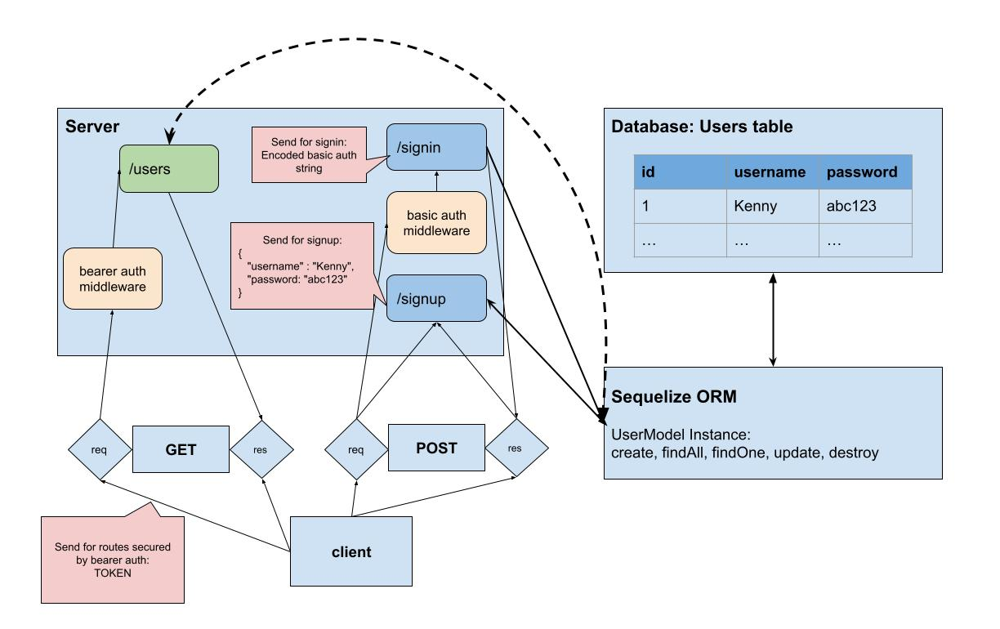

# LAB - Class 07

## Project: Bearer Authorization

### Author: Kenny W. Lino

### Problem Domain  

In this lab, we were given starter code that contained numerous bugs that needed fixing in order to get the application to work. In order to make sure everything worked as expected, we had a number of tests given to us to test against as we corrected the errors.

### Links and Resources

- [ci/cd](https://github.com/kennywlino/bearer-auth/actions/new)
- [back-end server (production)](https://bearer-auth-y7xw.onrender.com)
- [Main PR from dev](https://github.com/kennywlino/bearer-auth/pull/1)

### Setup

#### `.env` requirements (where applicable)

i.e.

- `PORT` - Port Number
- `DATABASE_URL` - location of Postgres DB (i.e. postgres://localhost:5432/api-app?sslmode=disable)
- `SECRET` - secret used with bearer auth

#### How to initialize/run your application

- nodemon

#### How to use your library (where applicable)

#### Features / Routes

- POST: `/signin` - route to signin with given user and password
- POST: `/signup` - route to signup with given user and password
- GET: `/users` - route to get all users with given bearer auth token
- GET: `/secret` - route to access a secret

#### Tests

- How do you run tests?
  - npm test

- Any tests of note?

#### UML

